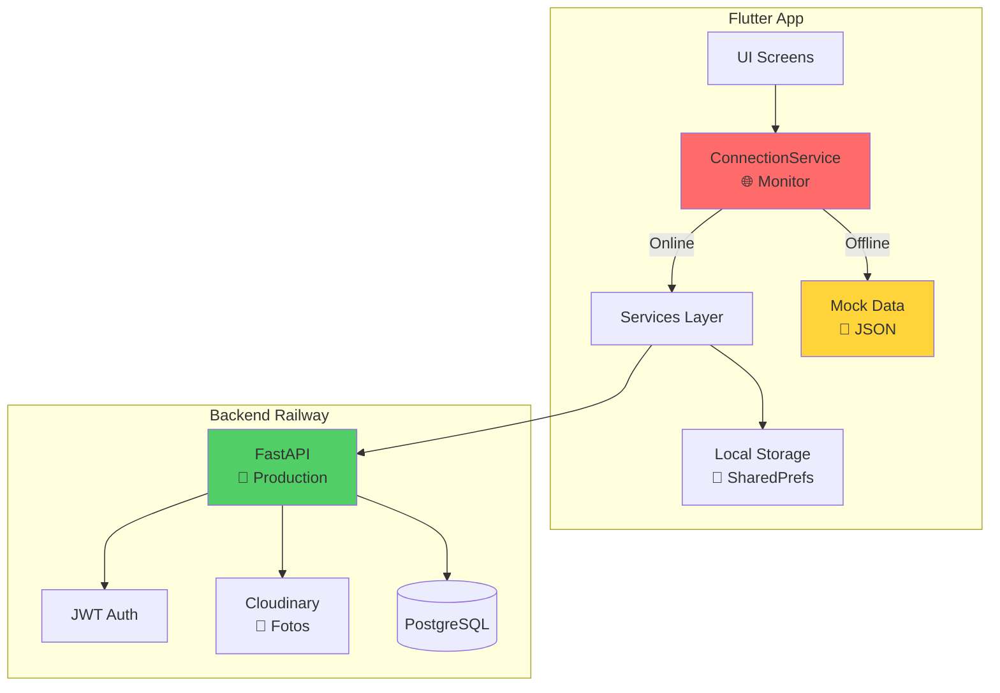
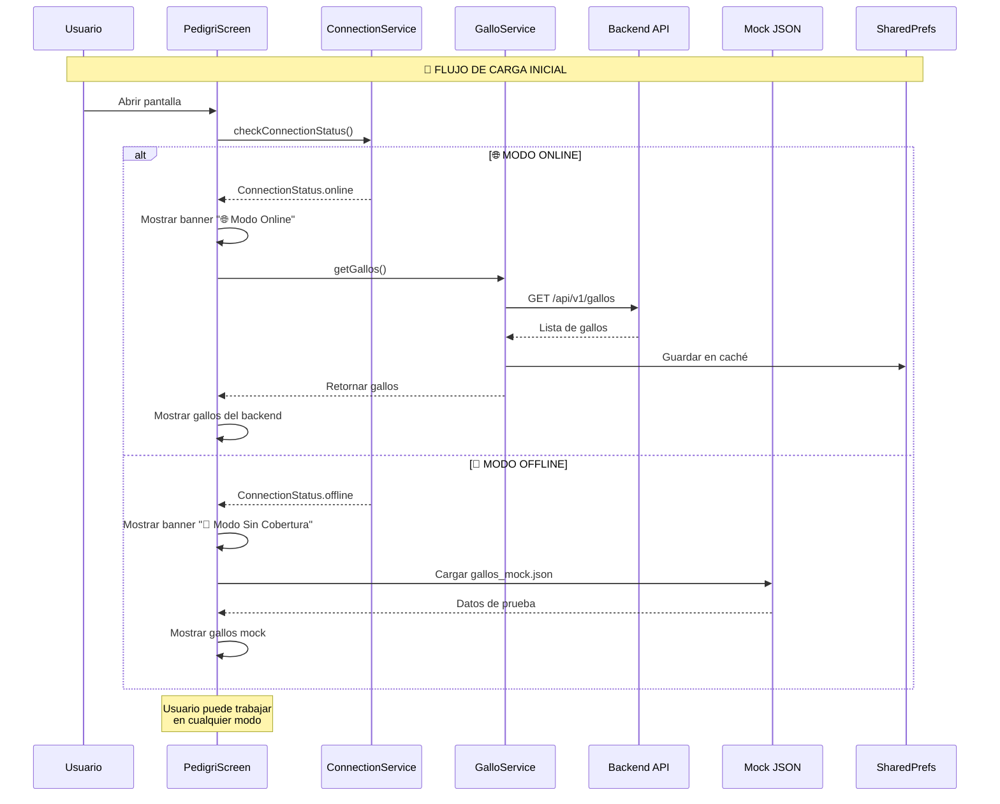
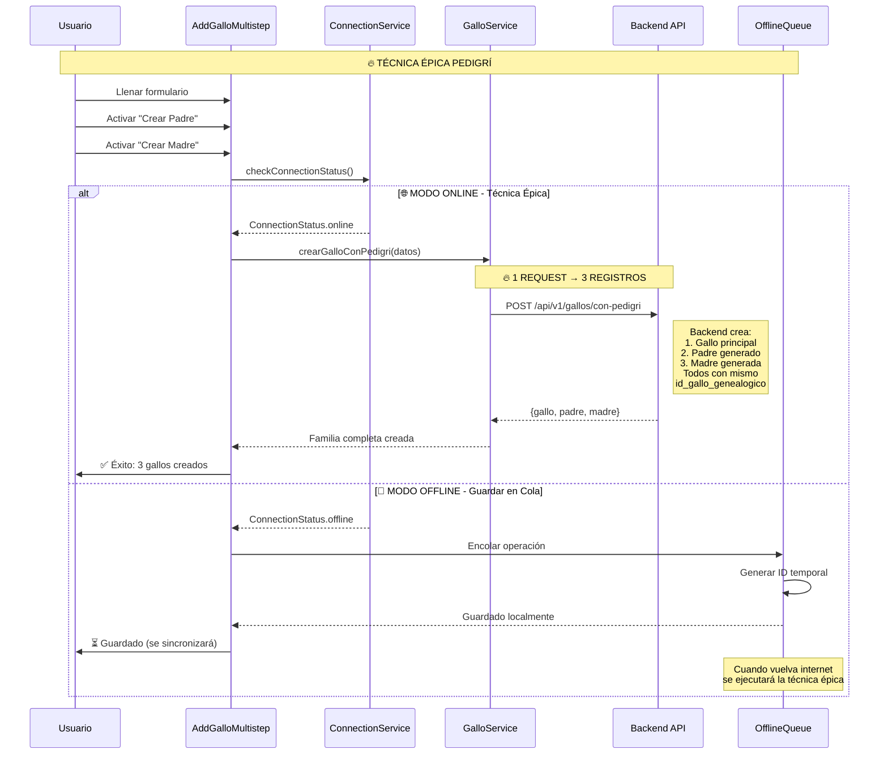
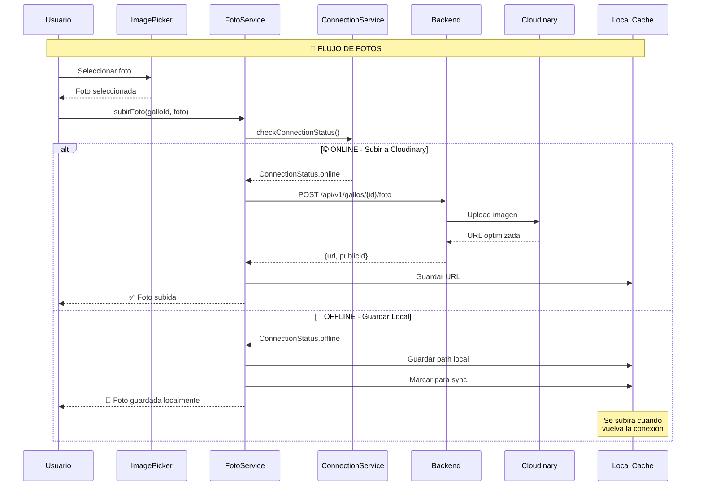
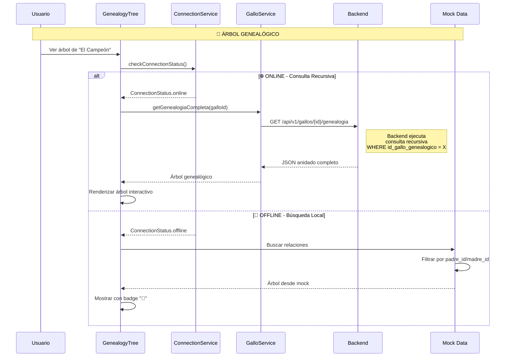
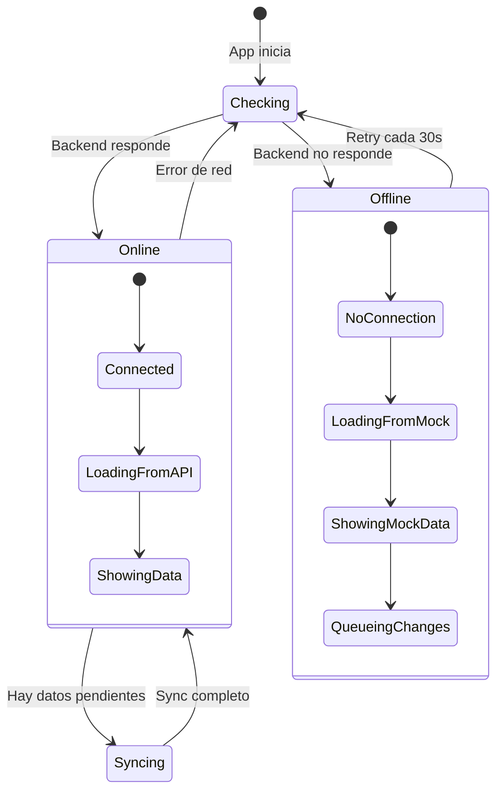

# 🔥 INTEGRACIÓN BACKEND-FLUTTER ÉPICA - GALLOS APP

> **Documento maestro de integración con diagramas de secuencia**  
> Sistema con modo ONLINE/OFFLINE inteligente

---

## 📊 ARQUITECTURA GENERAL DEL SISTEMA



---

## 🎯 MAPA DE SERVICIOS Y FORMULARIOS

### 1️⃣ **PedigriScreen (Lista Principal)**



### 2️⃣ **AddGalloMultistepScreen (Formulario Multi-Paso)**



### 3️⃣ **Gestión de Fotos con Cloudinary**



### 4️⃣ **GenealogyTreeScreen (Árbol Genealógico)**



---

## 📁 ESTRUCTURA DE ARCHIVOS MOCK

### gallos_mock.json
```json
{
  "gallos": [
    {
      "id": 1,
      "nombre": "El Campeón",
      "codigo_identificacion": "CHAMP001",
      "peso": 2.8,
      "altura": 48,
      "color": "Giro",
      "estado": "activo",
      "id_gallo_genealogico": 123,
      "padre_id": 2,
      "madre_id": 3,
      "tipo_registro": "principal",
      "foto_principal": "assets/images/gallos/gallo1.jpg",
      "created_at": "2024-01-15T10:00:00",
      "raza": {
        "id": 1,
        "nombre": "Kelso"
      }
    },
    {
      "id": 2,
      "nombre": "Padre Campeón",
      "codigo_identificacion": "PAD001",
      "id_gallo_genealogico": 123,
      "tipo_registro": "padre_generado",
      "padre_id": 4,
      "madre_id": 5
    },
    {
      "id": 3,
      "nombre": "Madre Campeona",
      "codigo_identificacion": "MAD001",
      "id_gallo_genealogico": 123,
      "tipo_registro": "madre_generada"
    }
  ],
  "razas": [
    {"id": 1, "nombre": "Kelso"},
    {"id": 2, "nombre": "Hatch"},
    {"id": 3, "nombre": "Sweater"}
  ]
}
```

---

## 🔄 SERVICIO DE CONEXIÓN Y SINCRONIZACIÓN

### ConnectionService - Estados


---

## 🎯 MAPEO DE ENDPOINTS A SERVICIOS

| Pantalla | Acción | Endpoint Backend | Método Servicio | Fallback Offline |
|----------|---------|-----------------|-----------------|------------------|
| **PedigriScreen** | Listar gallos | `GET /api/v1/gallos` | `GalloService.getGallos()` | `gallos_mock.json` |
| | Eliminar gallo | `DELETE /api/v1/gallos/{id}` | `GalloService.deleteGallo()` | Queue para sync |
| **AddGalloMultistep** | Crear con pedigrí | `POST /api/v1/gallos/con-pedigri` | `GalloService.crearGalloConPedigri()` | Guardar local + queue |
| | Actualizar gallo | `PUT /api/v1/gallos/{id}` | `GalloService.updateGallo()` | Queue para sync |
| | Subir foto | `POST /api/v1/gallos/{id}/foto` | `FotoService.subirFoto()` | Guardar path local |
| **GenealogyTree** | Árbol completo | `GET /api/v1/gallos/{id}/genealogia` | `GalloService.getGenealogiaCompleta()` | Búsqueda en mock |
| | Detalle gallo | `GET /api/v1/gallos/{id}` | `GalloService.getGalloDetalle()` | Buscar en mock |

---

## 🚀 PASOS DE IMPLEMENTACIÓN

### FASE 1: Base Services
1. ✅ `connection_service.dart` - Monitor de conexión
2. ✅ `gallo_service.dart` - CRUD gallos con técnica épica
3. ✅ `foto_service.dart` - Gestión fotos Cloudinary
4. ✅ `offline_queue_service.dart` - Cola de sincronización

### FASE 2: UI Adaptation
1. ✅ Banner de estado conexión en `BaseScreen`
2. ✅ Modificar `PedigriScreen` para dual mode
3. ✅ Adaptar `AddGalloMultistep` con queue
4. ✅ Update `GenealogyTree` para offline

### FASE 3: Sync System
1. ✅ Background sync cuando vuelve internet
2. ✅ Resolver conflictos de IDs temporales
3. ✅ Notificaciones de sync status

---

## 📱 EXPERIENCIA DE USUARIO

### Modo Online 🌐
- Banner verde: "✅ Conectado al servidor"
- Datos en tiempo real
- Fotos se suben a Cloudinary
- Técnica épica funciona completa

### Modo Offline 📴
- Banner naranja: "📴 Modo sin cobertura - Datos de prueba"
- Usa datos mock para lectura
- Cambios se guardan en cola
- Fotos se guardan localmente
- Sync automático cuando vuelve internet

---

## 🔒 CONSIDERACIONES DE SEGURIDAD

1. **JWT Token**: Renovar automáticamente
2. **Datos sensibles**: No guardar en SharedPrefs sin encriptar
3. **Fotos**: Limpiar caché periódicamente
4. **Mock data**: Marcar claramente como "DEMO"

---

*Documento actualizado para GALLOS APP con técnica épica de pedigrí*