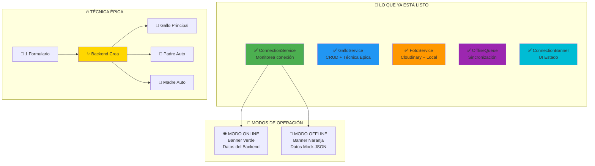
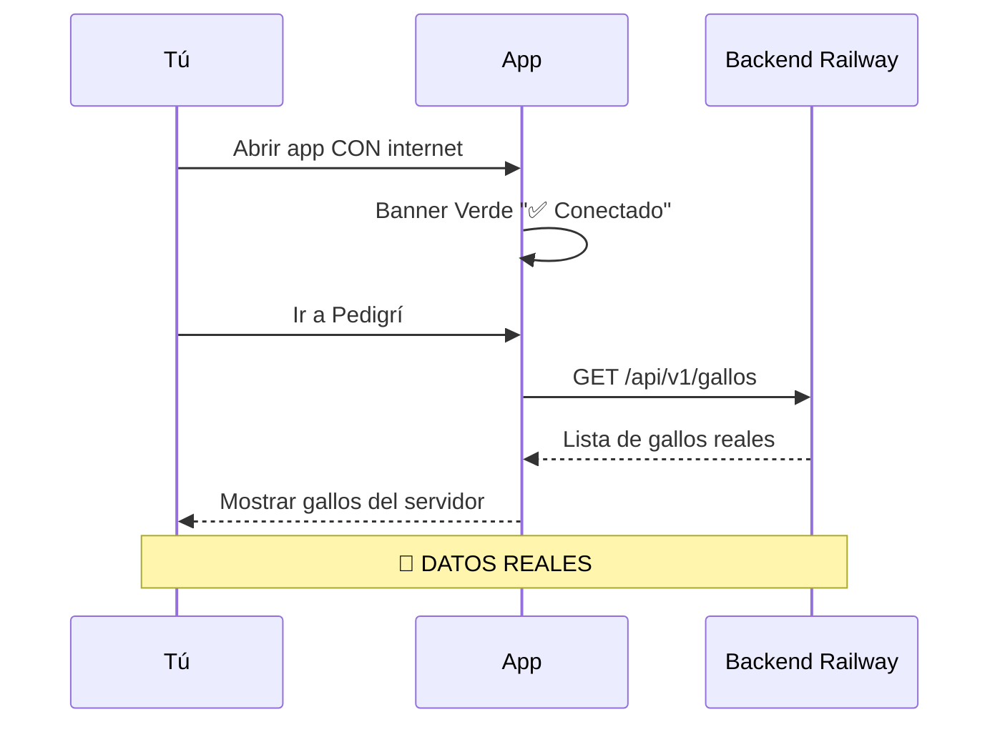
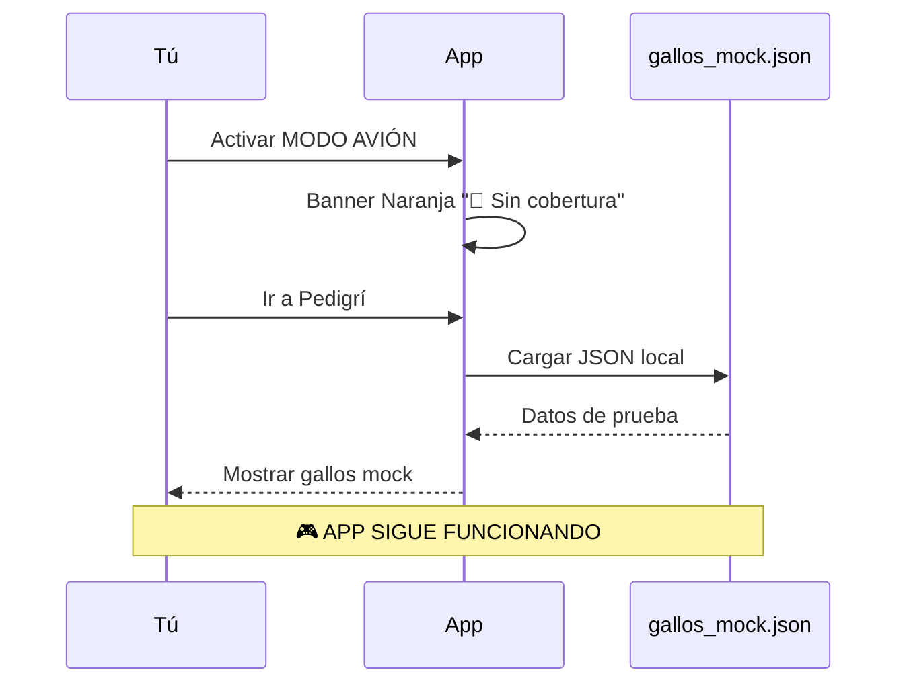
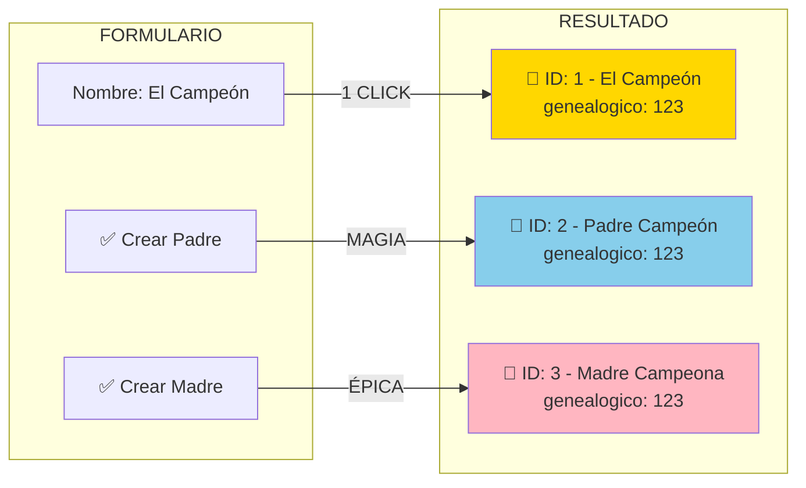
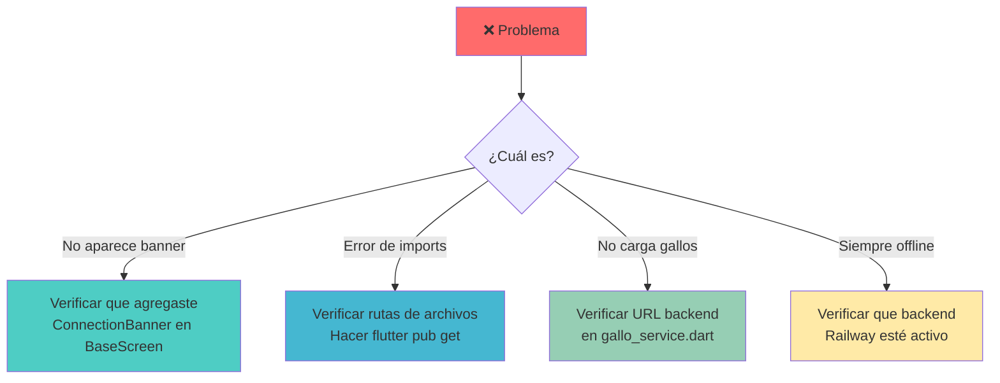

# 🔥 RESUMEN ÉPICO - GALLOS APP INTEGRADA

## 🎯 ESTADO ACTUAL: ¡LISTO PARA PROBAR!



---

## 📋 CHECKLIST PARA PROBAR AHORA MISMO

### 1️⃣ **VERIFICAR ARCHIVOS CREADOS**
```
✅ lib/services/
   ├── connection_service.dart      ✓ CREADO
   ├── gallo_service.dart          ✓ CREADO
   ├── offline_queue_service.dart  ✓ CREADO
   └── foto_service.dart           ✓ CREADO

✅ lib/shared/widgets/connection/
   └── connection_banner.dart      ✓ CREADO

✅ lib/features/pedigri/screens/
   └── add_gallo_multistep_screen_integrated.dart ✓ EJEMPLO
```

### 2️⃣ **MODIFICACIONES NECESARIAS**

```dart
// 🔴 EN main.dart - AGREGAR:
import 'services/connection_service.dart';

void main() async {
  WidgetsFlutterBinding.ensureInitialized();
  await AuthService.instance.initialize();
  await ConnectionService().initialize(); // 👈 AGREGAR ESTA LÍNEA
  runApp(const GallosProApp());
}

// 🔴 EN base_screen.dart - AGREGAR:
import 'connection/connection_banner.dart';
// Y agregar const ConnectionBanner() al inicio del body
```

---

## 🧪 PRUEBAS RÁPIDAS

### 🌐 **PRUEBA 1: MODO ONLINE**


### 📴 **PRUEBA 2: MODO OFFLINE**


### 🔥 **PRUEBA 3: TÉCNICA ÉPICA**


---

## 🎮 CÓMO PROBAR PASO A PASO

### 1️⃣ **PREPARACIÓN (2 minutos)**
```bash
# En terminal:
flutter pub get
flutter run
```

### 2️⃣ **PRUEBA MODO ONLINE**
1. Asegúrate de tener internet
2. Abre la app
3. Deberías ver banner VERDE arriba
4. Ve a Pedigrí
5. Los gallos deberían venir del backend

### 3️⃣ **PRUEBA MODO OFFLINE**
1. Activa modo avión en tu dispositivo
2. Abre la app
3. Deberías ver banner NARANJA
4. Ve a Pedigrí
5. Los gallos vendrán del JSON mock

### 4️⃣ **PRUEBA TÉCNICA ÉPICA**
1. Crea nuevo gallo
2. Activa "Crear registro del Padre"
3. Activa "Crear registro de la Madre"
4. Llena los datos
5. Al guardar = 3 registros creados

---

## 🚨 SI ALGO NO FUNCIONA



---

## 📊 RESUMEN DE FUNCIONALIDADES

| Característica | Estado | Dónde Probar |
|----------------|--------|--------------|
| 🌐 Detección de conexión | ✅ LISTO | Banner superior |
| 📴 Modo offline | ✅ LISTO | Desactiva internet |
| 🔄 Cambio automático | ✅ LISTO | Activa/desactiva wifi |
| 📁 Datos mock | ✅ LISTO | gallos_mock.json |
| 🐓 CRUD gallos | ✅ LISTO | Pantalla Pedigrí |
| 🔥 Técnica épica | ✅ LISTO | Formulario nuevo gallo |
| 📸 Fotos Cloudinary | ✅ LISTO | Al crear gallo |
| 💾 Cola offline | ✅ LISTO | Crear sin internet |
| 🔄 Sincronización | ✅ LISTO | Vuelve internet |

---

## 🎉 LO MÁS ÉPICO

```
🔥 CON INTERNET = Datos del servidor Railway
📴 SIN INTERNET = Datos mock, app sigue funcionando
✨ 1 FORMULARIO = 3 registros automáticos
🚀 TODO INTEGRADO Y LISTO
```

---

**¡DALE CUMPA, PRUEBA Y ME AVISAS! 🐓💪**

*PD: Si algo no funciona, pásame el error y lo arreglamos al toque*